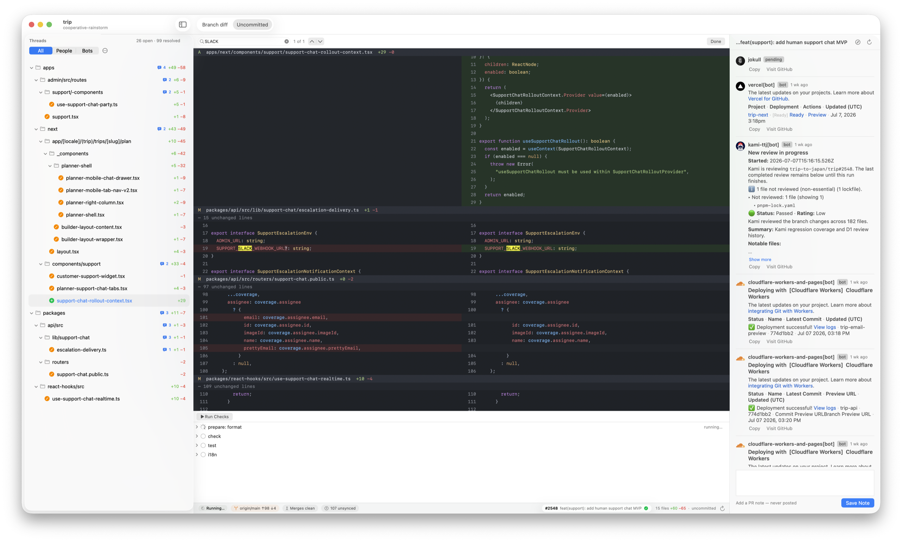

<p align="center">
  
</p>

<h1 align="center">preceipts</h1>

<p align="center"><strong>Local CI, proven by trees, merged by humans.</strong></p>

preceipts replaces the GitHub PR treadmill for teams that trust each other:
checks run on dev machines, results ("receipts") are keyed to git **tree
hashes** and stored in git notes, and landing a branch is a human/agent
decision informed by receipts — never gated by a server.



Two halves, one repo:

- **`swift/`** — the cockpit, a native macOS app (AppKit + SwiftUI islands,
  SwiftPM, no Xcode). A side-by-side diff surface with tree-sitter syntax
  highlighting, a file tree scoped to *branch diff* or *uncommitted*, ⌘F
  find, and the whole PR conversation pulled inboard: review threads
  anchored to diff rows, resolve/unresolve, comment editing, avatars,
  GFM-rendered bodies (images and GIFs included), filters for
  people/bots/resolved/outdated. Receipts stream into a drawer as checks
  run; the PR drawer shows the description, commit log, and the checks
  board — Actions, Vercel, Cloudflare. A quiet HUD keeps branch state,
  merge cleanliness, and colored diff stats in the footer.
- **`engine/`** — the receipts engine (TypeScript/Bun, zero runtime deps,
  git plumbing only). Ships as the `preceipts-engine` binary:
  `init · run · status · log · hud · land · sync · gc`, everything scriptable
  via `--json`, check runs streamable via `--events` (NDJSON).

## Why trees, not commits?

A receipt attached to a *tree hash* survives history rewrites: rebase,
reword, squash — if the content is identical, the proof still stands. And a
squash-land via `git commit-tree` produces a commit whose tree **is** the
proven tree, so "are we landing what we tested?" is a hash comparison, not a
policy.

Read [`PRD.md`](PRD.md) for the full design and decisions log.

## Quickstart

```sh
# engine (receipts, runs, land)
cd engine && bun install && bun run build     # → engine/dist/preceipts-engine

# cockpit (macOS 14+)
brew install libgit2
cd swift && swift build && swift test
swift run PreceiptsApp /path/to/repo          # or Scripts/package_app.sh → Preceipts.app

# in your repo
preceipts-engine init         # scaffold .preceipts/
preceipts-engine run          # run checks, mint receipts
preceipts-engine status       # receipt table for the working tree
preceipts-engine hud          # conflicts/freshness/sync at a glance
preceipts-engine land my-branch   # squash + trailers + push, receipts willing
```

Checks are plain executable files in `.preceipts/checks/` — exit 0 means
pass. Required checks are listed in `.preceipts/config.toml`.

GitHub features work out of the box through the `gh` CLI if you're logged
in, or sign in from the app's Settings (⌘,) with a device-flow OAuth app
for a Keychain-held token.

## Quality contract

The diff algorithm (patience + indent heuristic + word-level intraline),
tree-sitter highlighting (14 languages, raw C API, capture precedence
verified against tree-sitter-highlight), feedback parsing, and filters all
live in `PreceiptsKit` with XCTest coverage; the engine carries its own bun
test suite. `swift test` + `bun test` is the whole story.

## History

preceipts started as a TUI built on [lumen](https://github.com/jnsahaj/lumen)
by [@jnsahaj](https://github.com/jnsahaj) (MIT), then grew a Rust core and a
GPUI prototype before landing on the all-native Swift app (PRD decisions
10–11). The Rust workspace was removed from the working tree once its
algorithms and tests were ported — mine it via git history if needed.
